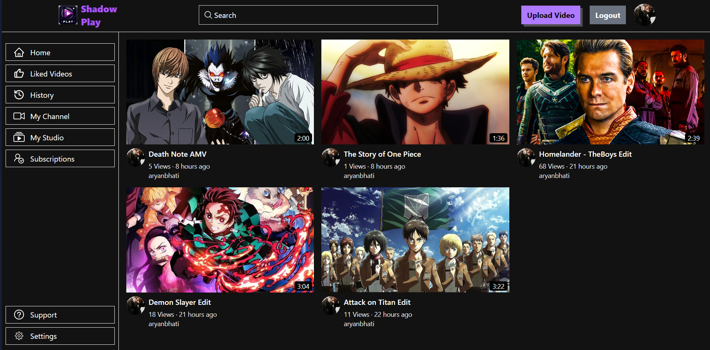
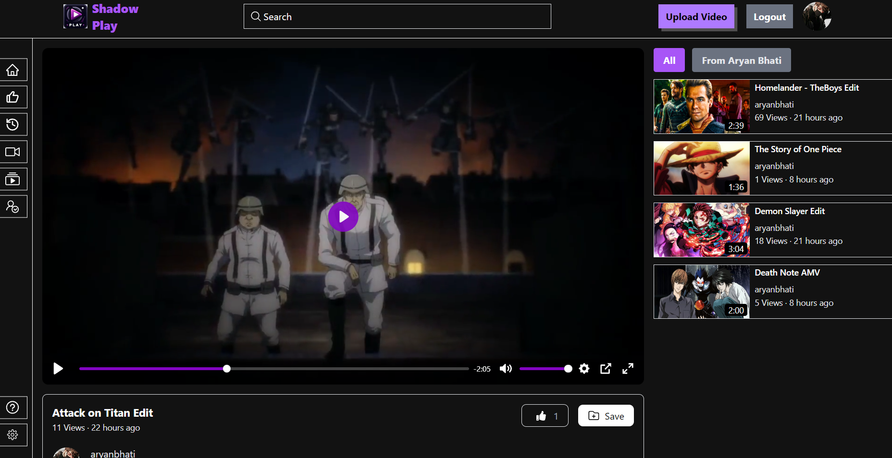

# Shadow Play - Seamless Video Streaming Experience

Watch and share videos effortlessly with Shadow Play, a user-friendly webapp that brings a variety of content to your fingertips.

## Screenshots 📸




## Deployed Link 🌐

The website is hosted at: 👉 [Shadow Play](https://shadowplay.vercel.app/)

## Table of Contents

- [Project Structure](#project-structure)
- [Technologies Used](#technologies-used-)
- [Libraries Used](#libraries-used-)
- [Description](#description-)
- [Features](#features-)
- [Screenshot](#screenshot-)
- [Getting Started](#getting-started-)
- [Usage](#usage-)
- [Contributing](#contributing-)
- [Acknowledgments](#acknowledgments-)

## Project Structure

- **index.html**: The main HTML file.
- **features**: Contains all state management slices.
- **main.jsx**: Handles the routing of the app.
- **api**: Contains API calls for getting, editing, and deleting videos.

## Technologies Used 🛠️

- ReactJS
- Tailwind CSS
- JavaScript
- Redux Toolkit
- Node.js
- Express.js
- MongoDB

## Libraries Used 🛠️

- react-router-dom
- axios
- react-icons
- redux-thunk
- mongoose

## Description 📝

Shadow Play is a simple and intuitive web application that allows users to watch and share videos. It provides an easy-to-use interface for browsing a variety of video content, as well as functionality for uploading and managing your own videos.

## Features ✨

- User-friendly interface
- User authentication and authorization
- Video upload and management
- Responsive design for mobile and desktop
- Video playback
- User profile management

## Getting Started 🏁

To run the project locally, follow these steps:

1. Clone the repository:

```bash
git clone https://github.com/AryanBhati07/Shadow-Play
```

2. Navigate to the project directory:

```bash
cd Shadow-Play
```

3. Install the required Node modules in both frontend and backend directories:

```bash
npm install
```

4. Configure the environment variables using .env.sample

5. Run the client and server:

```bash
npm run dev
```

6. Open your browser and go to:

```bash
localhost:5173
```

## Usage

1. **Sign Up or Log In**

   Create a new account or log in with an existing account.

2. **Watch Videos**

   Browse and watch videos from various categories.

3. **Upload Videos**

   Click on "Upload Video" to share your own content.

4. **Manage Your Profile**

   Edit your profile details and manage your uploaded videos.

## Contributing

We welcome contributions to enhance Shadow Play! Please follow these steps to contribute:

1. Fork the repository.
2. Create a new branch: `git checkout -b feature/your-feature-name`.
3. Make your changes and commit them: `git commit -m 'Add some feature'`.
4. Push to the branch: `git push origin feature/your-feature-name`.
5. Submit a pull request.

## Acknowledgments

Thanks to the developers of ReactJS, Tailwind CSS, Node.js, Express, and MongoDB for their amazing tools.

Atlast special Thanks to Hitesh Chaudhary for his wonderful tutorial on Youtube.
